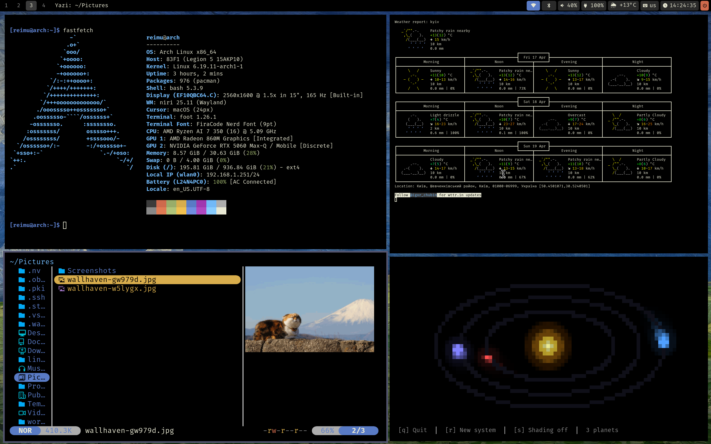
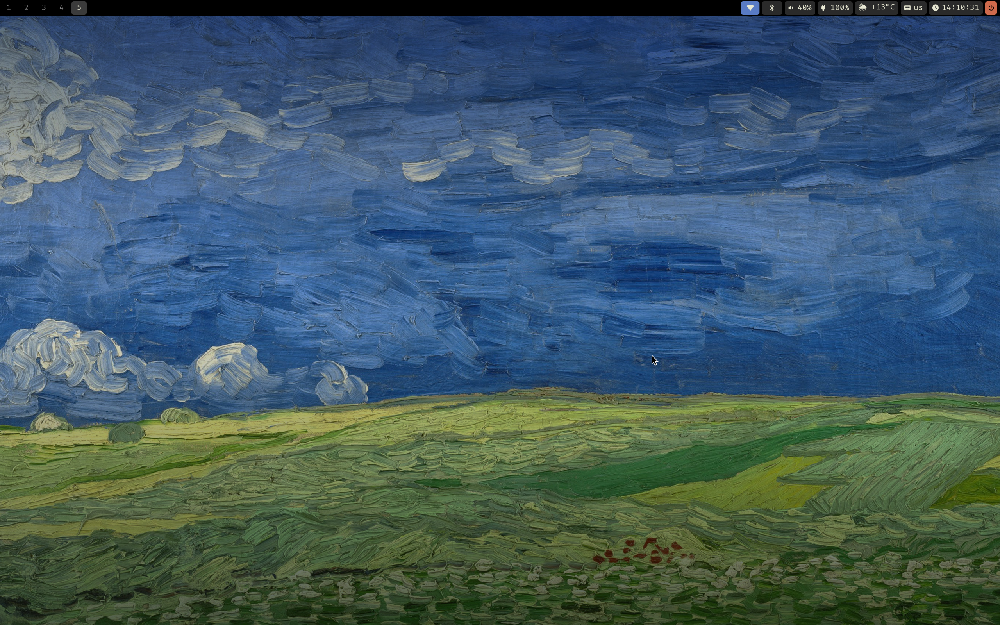
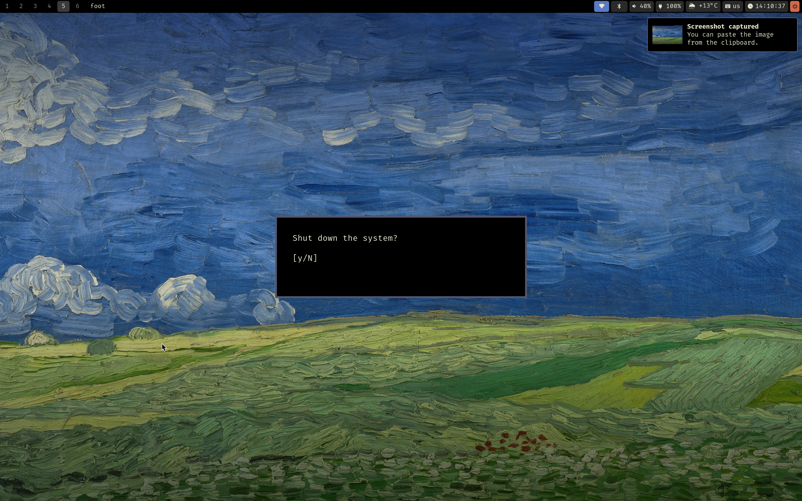

# dotfiles

My personal dotfiles for **Arch Linux** on a Lenovo Legion 5 15AKP10 (83F1), managed with [GNU Stow](https://www.gnu.org/software/stow/).

<p align="center">
  
  
</p>

## System

| Component | |
|---|---|
| OS | Arch Linux x86_64 |
| WM | [niri](https://github.com/YaLTeR/niri) (Wayland scrollable-tiling compositor) |
| Bar | [Waybar](https://github.com/Alexays/Waybar) |
| Terminal | [foot](https://codeberg.org/dnkl/foot) |
| Editor | [Neovim](https://neovim.io) (LazyVim) |
| Launcher | [Wofi](https://hg.sr.ht/~scoopta/wofi) |
| Notifications | [Mako](https://github.com/emersion/mako) |
| Screen locker | [Swaylock](https://github.com/swaywm/swaylock) |
| File manager | [Yazi](https://github.com/sxyazi/yazi) |
| Image viewer | [imv](https://sr.ht/~exec64/imv/) |
| AUR helper | [paru](https://github.com/Morganamilo/paru) |
| Font | FiraCode Nerd Font |
| Cursor | macOS (xcursor) |
| GPU | AMD Radeon 680M (iGPU) + NVIDIA GeForce RTX 5060 (dGPU) |

## Structure

```
~/.dotfiles/
- .bashrc
- .config/
  - niri/        - compositor config (KDL)
  - waybar/      - bar config and CSS
  - foot/        - terminal colors and font
  - nvim/        - Neovim / LazyVim
  - wofi/        - launcher style
  - mako/        - notification daemon
  - swaylock/    - lock screen
  - yazi/        - file manager theme
  - imv/         - image viewer keybinds
  - paru/        - AUR helper settings
  - git/         - global gitignore
  - Code/        - VS Code settings
```

## Installation

```bash
git clone https://github.com/aywski/dotfiles ~/.dotfiles
cd ~/.dotfiles
stow .
```

Stow will symlink everything into `$HOME`, skipping entries listed in `.stow-local-ignore`.

## Custom shutdown prompt

The power button in Waybar spawns a minimal `foot` window (`app-id=poweroff-confirm`) that asks for confirmation before shutting down. niri positions it as a floating centered dialog via a window rule.

<p align="center">
  
</p>

## Notes

See [sound-settings-guide.md](sound-settings-guide.md) for audio fixes specific to the Lenovo Legion 5 15AKP10 (83F1) (built-in DMIC fix with SOF driver).
